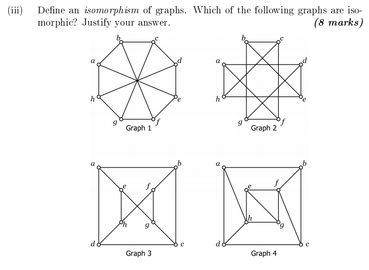

Morning
----
[Slides](../Slides/Lecture1.html)

In the morning, we discussed basic course policies, including the impending doom of the UCU strike, looked at examples and basic definitions of graphs, defined the degree of a vertex, looked at how it came up in chemistry, and proved Euler's handshaking lemma, and then introduced the Instant Insanity puzzle, also known as the four cubes problem.

Afternoon
----
[Slides](../Slides/Lecture2.html)

In the afternoon, we showed how to solve instant insanity, defined subgraphs, defined isomorphisms of graphs, discussed complexity theory, P vs. NP and the graph isomorphism theorem as bits of mathematical culture, and then gave some practical hints about how to show graphs are or aren't isomorphic.

Note: The slides above contain some quick discussion on the automorphism groups of graphs, which we skipped over and won't really be using.  We ended the class with an example of deciding whether or not graphs are isomorphic, taken from the 2015 exam:

We quickly saw that Graphs 1-3 were regular of degree 3, which Graph 4 had some vertices of degree 4; hence Graph 4 couldn't be isomorphic to the others, but we didn't finish the question.  It's worth thinking about more now -- I'll give a hint in the comments now, and we'll discuss it a bit next week...

Links:
----
- [The Union's FAQ about the strike](https://www.ucu.org.uk/uss-action-faqs)
- Timothy Gower's [blogpost](https://gowers.wordpress.com/2007/10/19/my-favourite-pedagogical-principle-examples-first/) on "Examples first"
 
