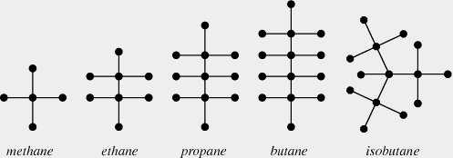

Note: This lecture didn't happen because I was ill; the material presented here either has gotten absorbed into other lectures or problem sets, or won't be examined; I leave it here for completeness.

A useful concept when studying trees is that of a leaf:

Definition
======

A *leaf* in a tree is a vertex of degree 1.

Lemma
===

Every finite tree with at least two vertices has at least two leaves.

Lemma
===

Every finite tree with at least two vertices has at least two leaves.

Proof 1: using paths
===

Suppose $$T$$ is at tree.  Since $$T$$ has at least two vertices, at has at least one edge.  Pick any edge $$e$$, say, between $$a$$ and $$b$$.  If the vertex $$a$$ is a leaf, we have at least one leaf.  If not, there is another edge incident to $$a$$. and we can start a path from $$a$$ away from $$e$$ following this edge.  As long as the end vertex of our path is not a leaf we may continue our path, and we will never return to a vertex we have already encountered, since trees have unique paths between vertices.  Since $$T$$ is finite, the path must eventually terminate -- i.e., find a leaf. 

Following the same argument from the vertex $$b$$ produces another leaf.
$$\square$$

Proof 2: using handshaking
=======
We will use that $$\Gamma$$ is connected, has $$n>2$$ vertices, and $$n-1$$ edges.

Since $$\Gamma$$ is a tree it is connected; since it has connected and has two vertices it cannot have any vertices of degree 0.

Thus, if we assume for a contradiction that $$\Gamma$$ has no leaves, then every vertex $$\Gamma$$ had degree at least two.  Since we know $$\Gamma$$ has $$n$$ vertices and $$n-1$$ leaves, applying the handshaking lemma gives:

$$2n-2=2 |E(\Gamma)|=\sum_{v\in V(\Gamma)} d(v)\geq \sum_{v\in V(\Gamma)} 2=2n$$
a contradiction.  For the inequality to hold, $$\Gamma$$ must have at least two vertices of degree 1.  $$\square$$

Leaves will play a very important role in this afternoon's lecture on the Prüfer code.  In the meantime, we point out that the handshaking argument we give another application of the handshaking lemma argument above.   Recall that in the last lecture we stated the following, but did not provide a full proof:

Proposition
===

Let $$\Gamma$$ be a graph with $$n$$ vertices.  The following are equivalent:

1. $$\Gamma$$ is a tree.
2. Between any two vertices $$a,b\in V(\Gamma)$$, there is a unique path.
3. $$\Gamma$$ is connected, but removing any edge makes $$\Gamma$$ disconnected.
4. $$\Gamma$$ has no cycles, but adding any edges to $$\Gamma$$ creates a cycle.
5. $$\Gamma$$ is connected and has $$n-1$$ edges
6. $$\Gamma$$ has no cycles and has $$n-1$$ edges

In lecture we showed that 1-3 are equivalent, and that if $$\Gamma$$ is a tree with $$n$$ vertices, then $$\Gamma$$ has $$n-1$$ edges, and hence that any of 1-3 imply 5 and 6.  Today we are going to use that 5 implies 1, hence we will prove it. 

Lemma
=====
Suppose that $$\Gamma$$ is connected and has $$n$$ vertices and $$n-1$$ edges.  Then $$\Gamma$$ is a tree. 

Proof
=====
 We will use induction.  As a base case, the result is clear if $$n$$ is 1 or 2.  Thus, we assume that all connected graphs with $$k<n$$ vertices and $$k-1$$ edge are trees, and we must show that if $$\Gamma$$ is connected and has $$n-1$$ edges, then $$\Gamma$$ is a tree.

Note that $$\Gamma$$ has at least two vertices of degree 1, as the handshaking lemma argument given above only uses the facts that $$\Gamma$$ is connected and has the right number of leaves.

Now suppose that $$v\in \Gamma$$ has degree one, and let $$e$$ be the edge incident to $$v$$.  Let $$\Gamma^\prime$$ be the graph obtained by removing $$v$$ and $$e$$.  Then $$\Gamma^\prime$$ has $$n-1$$ vertices and $$n-2$$ edges.  Further, since $$\Gamma$$ was connected, we see that $$\Gamma^\prime$$ is as well.  Thus, by the inductive hypothesis, $$\Gamma^\prime$$ is a tree, and so $$\Gamma$$ is as well

Chemistry Application: Alkanes
----

In organic chemistry, an *alkane* is a molecule with formula $$C_nH_{2n+2}$$.  The simplest Alkanes are methane $$CH_4$$, ethane $$C_2H_6$$ and propane $$C_3H_8$$.

It appears from the graph that Alkanes are all trees; we prove that now.

Lemma
===
Any alkane $$C_nH_{2n+2}$$ is a tree.

Proof
===

We will use that a connected graphs on $$m$$ vertices with $$m-1$$ edges is a tree.  

Any graph of a molecule is necessarily connected, and so to prove an Alkane is a tree we must count the number of vertices and edges.  

There are $$n+(2n+2)=3n+2$$ vertices.  

We count the edges using the Handshaking lemma. Carbon atoms have valency 4, and there are $$n$$ of them, while Hydrogen atoms have valency 1.  Thus, the sum of all the degrees of the vertices is $$6n+2$$.  The number of edges is half of these, namely $$3n+1$$, which is 1 less than the number of vertices.  Since to be an atom it must be connected, we see that any Alkane is a tree.  $$\square$$

Isomers
----

Definition
===

Two molecules are *isomers* if they have the same molecular formula, but the molecules are put together in a different way.

When there are 1, 2 or 3 carbon molecules, the only possible Alkanes is a line of carbon molecules.  The resulting chemicals are methane, ethane, and propane.  when $$n=4$$, there are two possible alignments of the Carbon atoms: in a line, which is butane, or in a `T' shape, which is isobutane; when $$n=5$$, there are three different possibilities.  

Around 1875, Hamilton used graph theory to count the number of isomers of the Alkane $$C_nH_{2n+2}$$.  One can forget about the placement of the hydrogen molecules, and just count the struture of the carbon molecules; these two will be a tree.  Since the valency of Carbon is four the maximum degree of a vertex in these trees will be 4, and so counting isomers of $$C_nH_{2n+2}$$ is equivalent to counting isomorphism classes of trees with $$n$$ vertices, all of degree at most 4.

