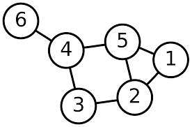

Definition
===

A *forest* is a graph with no cycles; a *tree* is a connected graph with no cycles.

Thus, a forest is a disjoint union of trees.

Example
====

The following graph is a forest consisting of three trees:

The following graph is a *not* a tree:

Consider the two conditions of being tree: being connected, and not having any cycles.  

The first condition is somehow saying that $$\Gamma$$ has *enough* edges: to be connected, we need a path between any two vertices, and the more edges we have, the more likely this is to happen.

The second condition is somehow saying that $$\Gamma$$ doesn't have *too many* edges: we *don't* want cycles, and having more edges makes that more likely.

Thus, being a tree a bit of a goldilocks condition -- it has *just the right* amount of edges.  It's not *just* how many edges the graph has, though -- the path graph $$P_4$$ has 4 vertices and 3 edges, and is a tree, but the disjoint union of a triangle and a single vertex also has 4 vertices and 3 edges but is not a tree.  

The following proposition summarises this discussion and makes it more precise:

Proposition
===

Let $$\Gamma$$ be a graph with $$n$$ vertices.  The following are equivalent:

1. $$\Gamma$$ is a tree.
2. Between any two vertices $$a,b\in V(\Gamma)$$, there is a unique path.
3. $$\Gamma$$ is connected, but removing an edge makes $$\Gamma$$ disconnected.
4. $$\Gamma$$ has no cycles, but adding any edges to $$\Gamma$$ creates a cycle.
5. $$\Gamma$$ is connected and has $$n-1$$ edges
6. $$\Gamma$$ has no cycles and has $$n-1$$ edges

Proof:
---

We first show the first 4 are equivalent.

1 implies 3
===

Trees are by definition connected, so we must show that removing any edge of $$\Gamma$$ disconnects $$\Gamma$$.  Let $$a$$ and $$b$$ be two adjacent vertices, and suppose removing the edge between them did not disconnect $$\Gamma$$.  Then there is a path from $$a$$ to $$b$$ in $$\Gamma$$ not using the edge connecting them; adding the last edge back in makes a cycle, a condtradiction.  

3 implies 2
====

 Since $$\Gamma$$ is connected, there is at least one path between two vertices.   If there were two paths between $$a$$ and $$b$$, then deleting any edge $$e$$ that was only in one of the paths wouldn't disconnected $$\Gamma$$.

2 implies 4
=== 

If $$\Gamma$$ had a cycle, then any two vertices on the cycle have two distinct paths between them (travel along the cycle in the two opposite directions).  If $$a$$ and $$b$$ are any two vertices, there is already a path between $$a$$ and $$b$$ - adding the edge $$a-b$$ would let us close this path into a cycle.

4 implies 1
====

 We must show that $$\Gamma$$ is connected: let $$a$$ and $$b$$ be any two vertices of $$\Gamma$$.  Since adding the edge between $$a$$ and $$b$$ creates a cycle, there must already be a path between $$a$$ and $$b$$.

We now show these are equivalent to the last two.

3 implies 5
====

 We proceed by induction on $$n$$.  If $$n=1$$, the graph is automatically connected; any edges would be loops and removing them would not make the graph disconnected, and so there must be 0 edges, as desired.  Now suppose $$n>1$$, and remove the edge between $$a$$ and $$b$$ from $$\Gamma$$.  The new graph is disconnected, so there are at least two components, call $$\Gamma_a$$ the component containing $$a$$ and $$\Gamma_b$$ the component containing $$b$$.  Since in the original graph every vertex had a path to both $$a$$ and $$b$$, in the graph after we've removed the vertex every graph must lie in one of these two components.  

Removing any edge from $$\Gamma_a$$ or $$\Gamma_b$$ disconnects them, and they have fewer vertices than $$\Gamma$$, and so by induction they have $$n_a-1$$ and $$n_b-1$$ edges, respectively.  Adding back the edge $$ab$$, we see the original graph $$\Gamma$$ had $$n_a-1+n_b-1+1=n-1$$ edges.

5 implies 6
===

Suppose that $$\Gamma$$ had a cycle; removing any edge from that cycle would not disconnect $$\Gamma$$, a contradiction.

6 implies 5
===
 Suppose that $$\Gamma$$ were disconnected.  Then $$\Gamma$$ is a disjoint union $$k>1$$ connected component of $$\Gamma$$.  Each component, being connected and having no cycles, is a tree;  we have already proven that a tree with $$n$$ vertices has $$n-1$$ edges.  The total number of edges in $$\Gamma$$ would then be $$n-k$$, a contradiction.

6 and 5 together imply 1
====

 This is clear; $$\Gamma$$ is connected and has no cycles. $$\square$$

