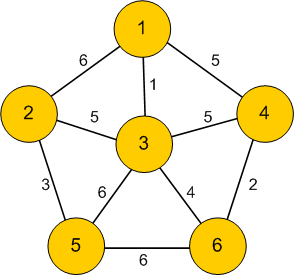

Spanning trees
----

Definition
===
Let $$\Gamma$$ be a graph.  A *spanning tree* of $$\Gamma$$ is a subgraph $$T\subset \Gamma$$ such that $$T$$ is a tree and $$T$$ contains every vertex of $$\Gamma$$.

Spanning trees are useful because they are a minimal connected subgraph that lets us get to all of $$\Gamma$$.  For instance, if the vertices are cities and the edges are roads, a spanning tree is a minimal set of edges that guarantee that you can get from any one city to another.

Examples:
===

- The cycle graph $$C_n$$ has $$n$$ spanning trees obtained by deleting any one edge.  

- A spanning tree of the complete graph $$K_n$$ is the same thing as a labelled tree, so there are $$n^{n-2}$$ such spanning trees by Cayley's theorem.

Lemma:  
====
Every connected graph $$\Gamma$$ has a spanning tree.

Proof
====
By our characterisation of trees, if $$T$$ is connected and has no cycles, then $$T$$ is a tree.  So it is enough to find a connected subgraph $$T$$ of $$\Gamma$$ that contains every vertex.

Let $$H$$ be any subgraph of $$\Gamma$$ that is connected and contains all the vertices of $$\Gamma$$.  If $$H$$ has a cycle, we can pick any edge $$e$$ of that cycle and delete it, and $$H$$ will still be connected: any path that used $$e$$ can use the rest of the cycle instead.  

Thus, starting from $$\Gamma$$, we may repeatedly remove edges from cycles and not disconnect $$\Gamma$$ until there are no more cycles left; the result will be a spanning tree.  $$\square$$

Introduction to optimisation problems
----

One motivation for introducing trees was as the "cheapest" way of connecting $$n$$ points.  Here, "cheapest" just means the least number of edges.  In real world applications, not all edges are created equal.  For example, consider the case where the vertices of $$\Gamma$$ represent cities, and the edges are roads connecting them.  If we're looking for the shortest path between two cities, we do not just want the least number of edges, as some roads will be longer than others, or be busy and take longer to drive.  These subtleties can be addressed with a *weighted graph*.

Definition
===

A *weighted graph* is a graph $$\Gamma$$, together with a non-negative real number $$w(e)$$ for each edge $$e\in E(\Gamma)$$.

Example
===

Typically, weighted graphs are presented by drawing labelling each edge of the graph with its weight:

Real world examples of weights
===
Even in the case where the vertices of $$\Gamma$$ are cities and the edges are conenctions between them, there are many possible interpretations of edges weights:
 - The edge weights $$w(e)$$ might represent the cost of building or maintaining the road between the city
 - The edge weights migth represent the distance between the cities
 - The edge weights might represent travel times between the cities
 - the edge weights might represent the cost of a train/plane ticket between the cities

In the next few class lectures, we will discuss the following optimisation problems for weighted graphs:

 - The *minimal spanning tree* -- finding a spanning tree $$T$$ of $$\Gamma$$ where the total cost of the edges in $$T$$ is the cheapest among all spanning trees of $$\Gamma$$.
 - The *shortest path* -- finding a path between two vertices of $$\Gamma$$, where the total weight of all the edges in the path is minimal among all paths between the two vertices.
 - The *traveling salesman problem* -- finding a hamiltonian cycle in a graph $$\Gamma$$ where the total weight of all the edges is minimal.

Kruskal's algorithm
----

We now present Kruskal's algorithm, which solves the problem of finding a minimal weight spanning tree in a weighted graph $$\Gamma$$.  Before discussing the algorithn, let's look at a toy example to get an idea of the problem.

Example
===

Consider the following weighted graph:

Obviously, there are three spanning trees, obtained by removing one of the three edges.  The spanning tree A-B-C has weight 7, B-C-A has weight 6, C-A-B has weight 5, and so we have found the cheapest spanning tree.

Any finite graph will only have finitely many spanning trees, and so it is always possible to exhaustively find all of them, compute their weights, and hence find the cheapest.  However, for large graphs there will be many spanning trees.  For example, a spanning tree of the complete graph $$K_n$$ is equivalent to a labelled tree on $$n$$ vertices, and by Cayley we know there are $$n^{n-2}$$ of these trees, which grows faster than exponential or factorial!  Thus, in practice, to find a minimal spanning tree we need a more efficient algorithm than brute forst checking all the possibilities.

Kruskal's algorthm
===

For finding spanning trees, it turns out there are several easy algorithms that will always find the cheapest spanning tree.  Many of them are *greedy algorithms*, which do not "plan ahead", but rather blindly do the best possible next step.  Kruskal's algorithm is an example of these, which builds a spanning tree $$T$$ step by step, starting from the subgraph of $$\Gamma$$ consisting just of the vertices of $$\Gamma$$ and no edges:

1. Find the cheapest edge $$e$$ remaining from $$\Gamma$$, and remove it from $$\Gamma$$.
2. If adding $$e$$ to $$T$$ will not make any loops, add it to $$T$$.  Otherwise, discard it.
3. Iterate the first two steps until $$T$$ is a spanning tree.

 In class we now ran an example of Kruskal's algorithm -- we'll skip that in the note, but there are many such examples available online, for instance, in <a href="https://www.youtube.com/watch?v=71UQH7Pr9kU"> this short Youtube video </a>.

Note that to have a spanning tree, the graph $$\Gamma$$ must be connected.  Running Kruskal's algorithm on a disconnected graph will produce a spanning tree for each component of $$\Gamma$$.

Proof of the correctness of Kruskal's algorithm:
===

From a mathematical point of view, the interesting part is to prove that running Kruskal's algorithm on a connected graph will always produce a minimal spanning tree.  There are two things to prove: that the end result of Kruskal's algorithm actually is a spanning tree, and that it is a minimal cost spanning tree.  We prove the first part now, and the second part in this afternoon's lecture.

To prove the first part, we first note that the graph $$T$$ produced by Kruskal's algorithm contains all the vertices of $$\Gamma$$, as they were all added at the beginning.  Thus, we only have to show that $$T$$ is a tree -- that is, it is connected, and that it has no cycles.

Suppose that $$T$$ consisted of more than one component.  Since $$\Gamma$$ is connected, there would be two components of $$T$$, say, $$C_1$$ and $$C_2$$, with edges between $$C_1$$ and $$C_2$$.  But adding the cheapest such edge to $$T$$ does not create any loops, and hence it would have been added by Kruskal's algorithm, a contradiction.

It is immediate that $$T$$ will not have any loops, because Kruskal's algorithm checks to make sure no loops are created before it adds an edge.  Thus, the output of Kruskal's algorithm is always a spanning tree.
