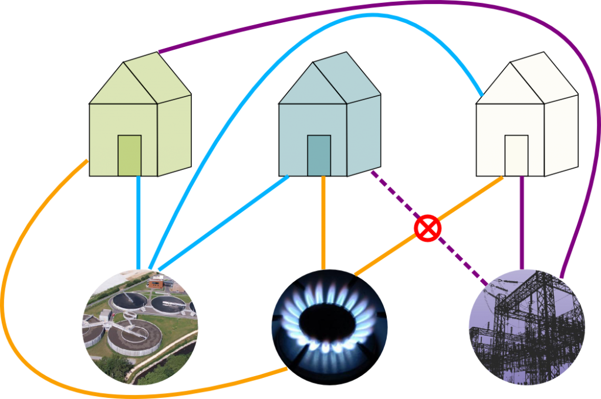

The next two weeks will be devoted to graphs on surfaces; we will cover planar graphs and Kuratowski's algorithm, drawing graphs on other surfaces, and Euler's theorem and applications.  As an introduction, we begin with the [Three utilities problem](https://en.wikipedia.org/wiki/Three_utilities_problem) (which apparently none of you had seen before).

An Old Chestnut 
====

Alice, Bob and Carol, each have a house, and each want to connect themselves to the power plant, the sewer plant, and the gas plant by independent underground lines.  Is it possible to do it so that none of these lines cross over each other?

In class, I tried to draw a solution, and came up with a drawing very like the following, stolen from [this site about the problem](http://www.science4all.org/article/eulers-formula-and-the-utilities-problem/):

However, this just shows one attempt at connecting them up fails; it seems very hard to prove that no such attempt could succeed, as there are lots of ways you could try to draw it.  However, later in this lecture we will show that it is impossible.  But first

A notational interlude:
-----

In the graph we are trying to draw in the Three Utilities Problem, we have two different types of vertices: the houses, and the utility factories.  The graph only has edges between vertices of one type and vertices of the other type.  Similar graphs occur frequently, and so we make the following definition:

We have typically viewed graphs as drawings in the plane, with the vertices as dots and the edges as lines between them.  Different choices of drawings of them same graph can look very different (as we saw with the Petersen graph).   One thing that is convenient is to have drawings where the edges never cross (we might wonder if the crossing is a vertex).  We are naturally then led to the following definition:

Definition
====

A graph is *planar* if it can be drawn in the plane ($$\mathbb{R}^2$$) so that none of the edges cross.

Definition
=====

A graph is *bipartite* if its vertices can $$V(\Gamma)$$ and can be separated into two sets, $$U$$ and $$W$$, so that any edge of goes between a vertex of $$U$$ and a vertex of $$W$$.  

The very first picture on the [wikipedia entry](https://en.wikipedia.org/wiki/Bipartite_graph) is the picture you should have in your head.

Example
====

The 4 cycle $$C_4$$ is bipartite, while the 3 or 5 cycles are not.

A special case is when every vertex of $$U$$ and is connected to every vertex of $$W$$ -- i.e., the graph has many edges as it can while still being simple and bipartite.  

Definition
=====

The complete bipartite graph $$K_{m,n}$$ has $$m+n$$ vertices, split into a set $$U$$ with $$m$$ vertices and $$W$$ with $$n$$ vertices.  For every $$u\in U$$ and $$w\in W, K_{m,n}$$ has exactly one edge.

Back to the puzzle: 
==

Returning back to the Utilities Problem, it should be fairly clear that it is equivalent to the following question: Is $$K_{3,3}$$ is planar?   Our next goal is to prove that it is not.

A tiny bit of topology
-----

Since we're trying to draw it in the plane, we are secretly starting to do a little bit of topology.  This is not a module on topology, and we will do as little as we can get away with, but it may help to highlight slightly where we use a little.  In particular, the main idea of the proof will use some form of the [Jordan Curve Theorem](https://en.wikipedia.org/wiki/Jordan_curve_theorem), which basically says that if we draw a simple closed curve (i.e., a circle) in the plane, it cuts it into two pieces, an inside and an outside.  This certainly sounds intuitively obvious, and would go without question to anyone besides a mathematician -- think about some of the nasty curves you encountered in Analysis!  

Main idea of the proof
===

The problem with trying to show a graph is nonplanar is that it seems at first glance that there are tons of possible ways to try to draw it in the plane, and so the proof would have a huge number of different cases, and it would be tricky to make sure you'd covered them all.  The main idea of the proof is to use the Jordan curve theorem as a way to eliminate a lot of cases and organize the remaining ones.  This idea is widely applicable, and in previous versions of the course was referred to as the "planarity algorithm", although we will not formalise it to the level of an algorithm.

The idea is the following: suppose that a graph $$\Gamma$$ was planar, and consider some closed walk $$W$$ in $$\Gamma$$ that doesn't repeat any vertices.  Then if we draw $$\Gamma$$ in the plane, then $$W$$ will be a circle, and so by the Jordan curve theorem every vertex or edge not in $$W$$ must either be on the inside or outisde of $$W$$.  One can then do a case-by-case analysis placing each vertex or edge inside or outside.  

Obviously, the fewer vertices and edges that aren't contained in $$W$$, the fewer cases our proof will have, and so in the best case )and the only ones we will consider) we take $$W$$ to be a Hamiltonian cycle.  

Proof that $$K_{3,3}$$ isn't Planar
====

Let the vertices $$a,b,c$$ be coloured red and vertices $$x,y,z$$ be coloured blue.  The path $$a-x-b-y-c-z-a$$ is a Hamiltonian cycle, that we draw as a circle in the plane, as shown below:

This contains 6 of the 9 edges of $$K_{3,3}$$; we need to add the edges $$a-y, b-z$$ and $$c-x$$.  The edge $$a-y$$ could be drawn inside the circle or outside, suppose we draw it inside, as shown below, with the added edge dashed.

Then on the inside of the circle, $$x$$ and $$c$$ are on different sides of the line $$a-y$$, and so the edge connecting them must go outside the circle.  The added edge could go around the right of the circle, as shown below here:

or around the left, as shown here:

But now $$b$$ and $$z$$ are different sides of $$a-y$$ inside the circle, and on different sides of $$c-x$$ outside the circle, and so cannot be connected without making two edges cross.

If we had began by drawing $$a-y$$ outside the circle, then we would have had to draw $$c-x$$ inside the circle, and had the same problem with being able to draw the last line; as shown here:

An unnecessary case and steoreographic projection
======

In the proof as presented, we do two cases that seem essentially identical -- namely, whether the first edge $$a-y$$ was drawn inside the circle or outside the circle.  In a good proof you don't want to consider more cases than necessary, so it's worth stopping to see if these cases are really "the same" or not.

At first glance, the inside and outside of the circle seem to appear very different: the inside has finite area, while the outside has infinite area.  However, here's a slightly different situation where the inside and outside are obviously interchangable: replace $$\R^2$$ with the sphere $$S^2$$, and draw the circle as the equator.  Then the "inside" is the northern hemisphere, and the "outside" is the southern hemisphere, and obviously we can just do a reflection to interchange them.

It seems like a huge leap to replace the plane with the sphere, but the sphere is really just the plane with one additional point!  Put another way, suppose we could draw $$\Gamma$$ on the sphere.  Our drawing would miss at least point, and if we cut open the sphere at that one point we could stretch the sphere out and lay it flat on the plane, giving a drawing of $$\Gamma$$ on the plane.

That sounded vague, but one way it can be made precise is the following: through [stereographic projection](https://en.wikipedia.org/wiki/Stereographic_projection), which the wikipedia page makes look complicated, but is really just this picture:

Draw the sphere as the unit sphere centerred at the origin, so the North pole is the point $$N=(0,0,1)$$.  Then, for any point $$Z\neq N$$ on the sphere, there is a unique line through $$N$$ and $$Z$$.  That line will meet the $$xy$$ plane in a unique point $$z$$.  Similarly, given any point $$z$$ in the $$xy$$ plane, the line through $$z$$ and $$N$$ will meet the sphere in one other point $$Z$$.  This gives a bijection between points on the plane, and points on there sphere (except for the north pole).

If discussion above we slightly lacking, there are lots of [fun videos](https://www.youtube.com/watch?v=6JgGKViQzbc) showing (variations of) stereographic projection on youtube.  I mentioned in particular [Henry Segerman's videos](https://www.youtube.com/watch?v=VX-0Laeczgk) that illustrated this using shadows and 3-d printed spheres.

Back to planar graphs
-------

If that digression into topology seemed long and pointless, the upshot is that if we're trying to prove a Hamiltonian graph is nonplanar, we can treat the inside and the outside of the circle as equivalent, and so when we try to add the very first edge we may as well put it inside.  This gives us one less choice, and so makes our proofs about half as long!  We will use this trick to show that:

The complete graph $$K_5$$ isn't planar
====

The proof is similar, in that we begin by picking a Hamiltonian cycle, say, $$a-b-c-d-e-a$$, and drawing this as a cirlce in the plane, and then try to add the remaining edges.  $$K_5$$ has $$5\cdot 4/2=10$$ edges, and 5 are contained in the cycle, so we have 5 more edges to add -- $$a-c, a-d, b-d,b-e$$ and $$c-e$$.

Since the inside and outside of the circle are equivalent, we will assume the first edge $$a-c$$ is drawn *inside* the circle, giving us the following picture:

  

It may be tempting to next consider the edge $$a-d$$, but this could be drawn either inside or outside the circle, and so we'd have to start considering cases.  We get a shorter, cleaner proof if we now move on to the vertex $$b$$.

  The vertex $$b$$ is separated from $$d$$ and $$e$$ on the inside of the circle by the line $$ac$$, and hence the edges $$b-e$$ and $$b-d$$ must be drawn on the outside of the circle.  These edges separate $$a$$ from $$d$$ on the outside of the circle, and so this must be drawn inside, giving the following picture:

But now we cannot add the final $$c-e$$, as $$c$$ and $$e$$ are separated from each other on both the outside and the inside of the circle.

  $$\square$$

