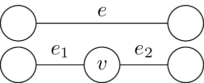
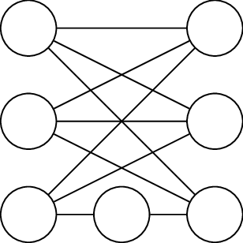
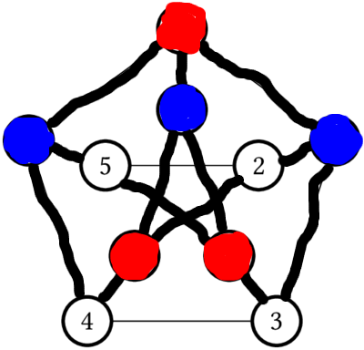
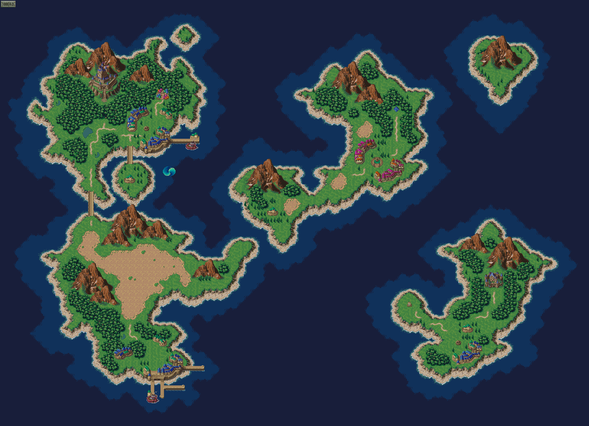
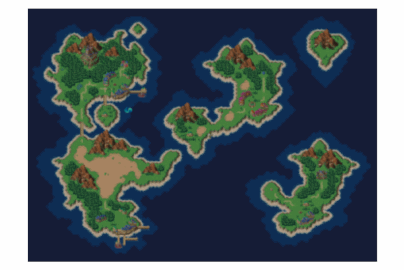
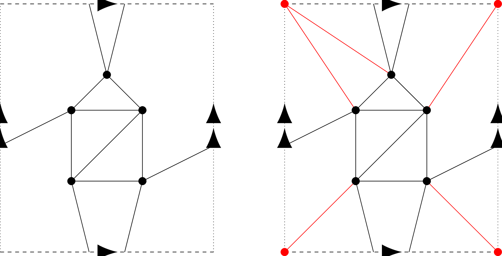
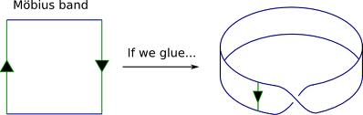
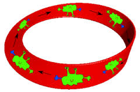

Last session we proved that the graphs $$K_{3,3}$$ and $$K_5$$ are not planar.  We now discuss Kuratowski's theorem, which states that, in a well defined sense, having a $$K_{3,3}$$ or a $$K_5$$ are the *only* obstruction to being non-planar.

 We begin with some two simple observations.

Observation 1
=====

If $$H$$ is a subgraph of $$G$$, and $$H$$ is not planar, then $$G$$ is not planar.

Proof
====

If we could draw $$G$$ in the plane, it would produce a drawing of $$H$$ in the plane, a contradiction.  $$\square$$

As an immediate corrolary, we see that $$K_n$$ is not planar for $$n\geq 5$$, as all such complete graphs contain $$K_5$$ as a subgraph; similarly, $$K_{m,n}$$ are not planar, with $$m,n\geq 3$$.

Our second observation is the following: suppose we took a graph $$\Gamma$$, and made a new graph $$\Gamma^\prime$$ by adding one vertex of degree 2 in the middle of one of the edges of $$\Gamma$$.  Then drawing $$\Gamma^\prime$$ is basically the same as drawing $$\Gamma$$, and then sticking an extra dot on an edge.  Hence, $$\Gamma^\prime$$ will be planar if and only if $$\Gamma$$ was.  

We now make this precise:

Definition
======

We say that $$\Gamma^\prime$$ is a subdivision of $$\Gamma$$ if it is obtained from $$\Gamma$$ by repeatedly choosing an edge $$e$$ and splitting it into two by adding a new vertex, as in the following picture: 

Observation 2
=====
Suppose that $$\Gamma^\prime$$ is a subdivision of $$\Gamma$$.  Then $$\Gamma^\prime$$ is planar if and only if $$\Gamma$$ is.

Example
=====
The following graph $$G$$ is nonplanar, since it is obtained from $$K_{3,3}$$ by subdividing a single edge.

Putting together the two lemmas, we see that if $$G$$ has a subgraph $$H$$, so that $$H$$ is a subdivision of a non-planar graph (like $$K_5$$ or $$K_{3,3}$$), then we $$G$$ isn't planar.  We illustrate this now in an exmaple.

Example: The Petersen graph is not planar
=====

The subgraph drawn with thick edges (containing all but two of the edges in the Petersen graph) is homeorphic to $$K_{3,3}$$.  we have drawn three vertices blue and three vertices red to highlight the vertices of $$K_{3,3}$$.  The nonhighlighted edges are in the subgraph, but they are the ones that are forgetten to show that the highlighted graph is homeomorphic to $$K_{3,3}$$.

Kuratowski's Theorem
========

A graph $$G$$ is nonplanar if and only if it contains a subgraph homeomorphic to $$K_5$$ or $$K_{3,3}$$.

Our two observations, together with this morning's result that $$K_{3,3}$$ and $$K_5$$ are nonplanar, prove the "if" direction.  The "only if" direction is much harder, and we will not prove it.

However, we will only use the "only if" direction implicitly.  Using the "only if" direction explicitly would amount to prove that some graph was planar by showing it had no subgraphs that were subdivisions of $$K_5$$ or $$K_{3,3}$$, which we would be quite laborious.  We have a much easier way to prove that a graph *is* planar: drawing it in the plane.

We will however, use the "only if" direction implicitly in the following way.  Suppose we have a graph $$G$$, and we want to determine if $$G$$ is planar or not.  We can try to prove it is planar by trying to draw it in the plane, and we can try to prove it is not planar by finding a subgraph of $$G$$ that is homeomorphic to either $$K_{3,3}$$ or $$K_5$$.  The "only if" direction of Kuratowski's theorem tells us that one or the other of these attempts will *always* work.  Thus, we have a practical method to determine whether or not a graph is planar or not -- try to draw it in the plane.  If you find this difficult, and begin to expect that it isn't possible, start looking for a subgraph homeomorphic to either $$K_5$$ or $$K_{3,3}$$, which would prove it can't be drawn on the plane.

Graphs on other surfaces
-------------

We now transition to drawing graphs on other surfaces.  In lecture, we had some <a href="http://slides.com/pauljohnson/deck-2#/">slides providing pictures</a> for the beginning of this discussion; a few, but not all, of those images are in the body of these notes now.

Trying to draw graphs on surfaces can be fun, but it seems like a rather unmotivated question to consider, so we began with motivating it by videogames.  Many videogames (pacman, asteroids, overhead RPGs like the early Final Fantasy games) take place on a rectangle screen:

To avoid making the world have an "edge", the result will often happen: if a character moves off the right of the screen it will reappear at the edge of the left screen, and similarly if a character moves off the top of the screen, it reappears on the corresponding place on the bottom of the screen.  

This set-up is used to simulate the surface of a planet.  However, if one traces through the result of these identifications, one sees that the surface is a torus:

Definition
=====

A "video-game graph" is one that "locally looks like" a part of graph paper.

Motivating Question
=======

If videogame designers were more clever, could they put a finite videogame graph on the sphere?  Can you prove that it isn't possible?

Drawing graphs on the torus
------

If we wanted to draw a graph on the sphere, we could do this physically by taking a balloon and a felt pen, but it would be a little awkward to turn in or mark homeworks this way.  Luckily, we saw last time that, using stereographic projection, drawing a graph on the sphere is equivalent to being able to draw it on the plane.

Similarly, we could draw graphs on torus by getting donuts, and writing on them with icing sugar.  But again, this is rather impractical, and we'd like a way to represent drawing a graph on a torus that is conveniently done on a piece of paper.  

The videogame / paper-folding discussion shows us how to do this.  We draw a square to represent the torus.  On the top and bottom border we draw one arrow in the same direction, to signify that these edges will be identified (this is how the paper was folded, or what a character does in the videogame).  We do similar with the side borders, with two arrows.  

Then we can draw the graph in the square, with the following added options -- if a drawn edge reaches the left (right) border, it continues at the same spot on the right (left) border, and similarly with the top/bottom borders.  

Example
====

$$K_5$$ and $$K_6$$ cannot be drawn on the plane, but they can be drawn on the torus as follows:

The graph on the left shows $$K_5$$ on the torus.  The picture on the right has the same drawing of $$K_5$$ in black, but in red has added an extra vertex and 5 extra edges incident to it to make a $$K_6$$.  There are appear to be 4 red vertices, at each corner of the square, but since all the corners get identified by the folding, they correspond to the same point of the torus. 

Challenge
=====

Draw $$K_7$$ on the torus.  

It turns out that $$K_8$$ cannot be drawn on the torus; we will prove this later.

What comes next?
-------
What other surfaces other than the sphere and torus are possible?  One possibility is just adding  "more holes"; this produces the "donut with $$g$$ holes", more formally known as the "suface of genus $$g$$".

You won't have to work with surfaces of higher genus, but it is worth knowing that this is an active area of research and investigation.  It turns out (try to prove it!  It's not hard...) that given any finite graph $$\Gamma$$, there is some $$g$$ so that $$\Gamma$$ can be drawn on a surface of genus $$g$$ without the edges crossing.  The *genus* of a graph $$\Gamma$$ is defined to be the lowest $$G$$ such that this can be done.

Nonorientable Surfaces
=======

Although you won't have to work with surfaces of higher genus, you will have to be able to work with a couple of other surfaces.  We will end this lecture by introducing the Mobius band:

Unorientable surfaces
-----

In this half of the lecture, we introduce the real projective plane, the simplest closed compact unorientable surface.  

Before we do that, it is easiest to review an unorientable surface with boundary that may be more familiar: the Mobius band.

The Mobius band
===

Suppose one has a strip of paper and glues the opposite edges together in the natural way -- this makes a cylinder.

If instead, one glued the ends together with half a twist, one would get the Mobius band:

The mobius band is not the same topological space as the cylinder.  One way to see this is that it is *unorientable* -- there is not a consistent notion of left and right on the Mobius band.  If you start at one point on the Mobius band, and travel along it until you jump across the other side of the identification, you will eventually return to where you started.  However, your left and right will have been interchanged!  This is seen in the following pictures, [stolen from this blog post](https://haggisthesheep.wordpress.com/2009/06/15/mobius-strips/):

The creature started out, his right hand was blue, but when he returns from his trip around the mobius band it is now his left hand that is blue!

