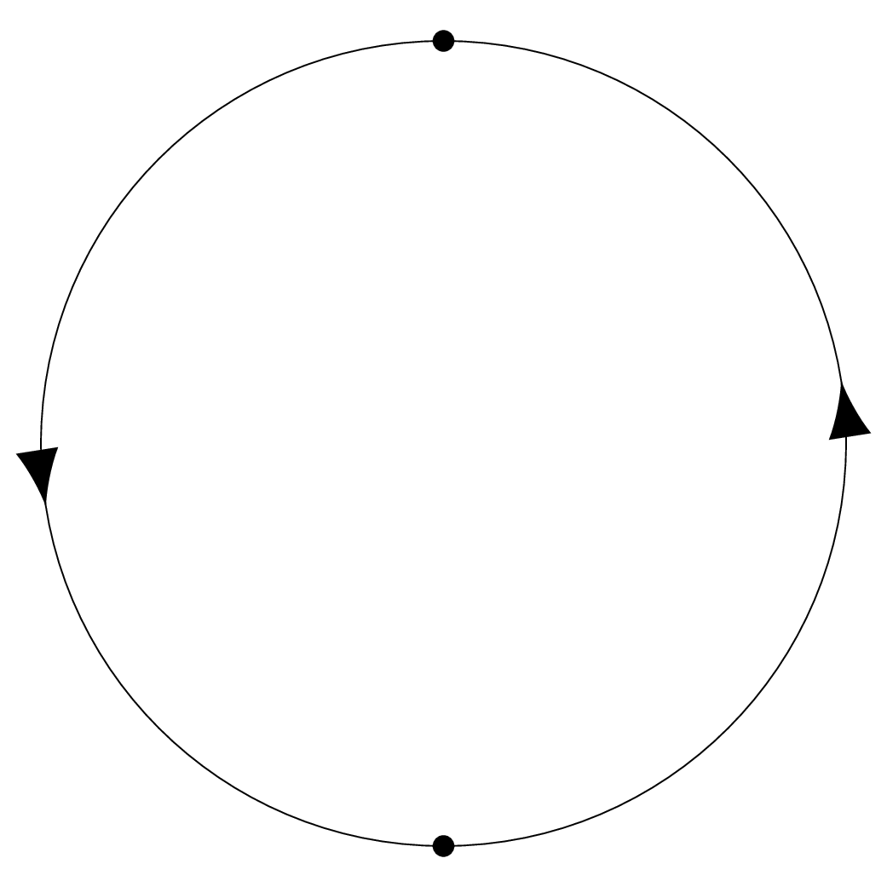
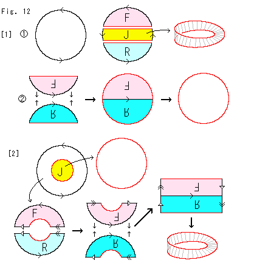
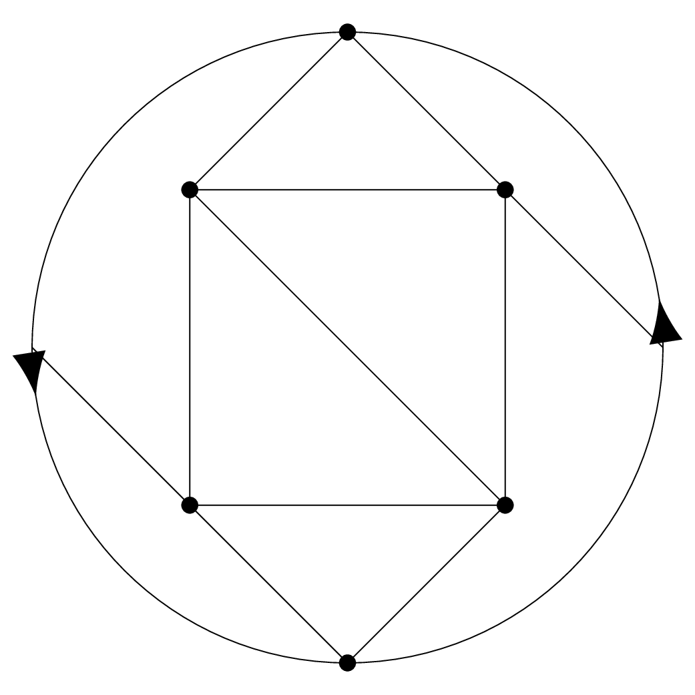
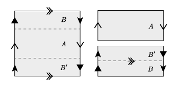
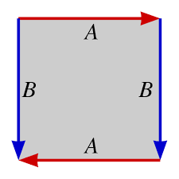
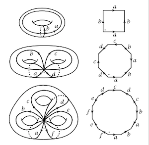

More Mobius
----------

At the end of the last lecture we briefly introduced the Mobius band.  This lecture, we briefly recalled what the Mobius band looked like, noted that it only has one edge, and as a warm-up drew $$K_{3,3}$$ on the Mobius band.

We noted that the Mobius band only had one edge; which didn't seem so scary.  However, this means that if you cut the Mobius band down the middle, it doesn't split into two pieces!  Note that this violates the Jordan curve theorem, the intuitive seeming that every circle as an inside and an outside.

Real Projective Plane
====

The Mobius band is nice, but it's a little annoying that it's just a surface with boundary, not just a surface -- you could walk off the edge.  However, we can fix this, by taking a disk, and gluing it to the Mobius band along the boundary circles.  The result is called the (real) projective plane, and written $$\mathbb{RP}^2$$.  The projective plane is a closed, compact surface, but you can't draw it in $$\mathbb{R}^3$$ without it passing through itself.  

We need a planar representation of the projective plane, along the same lines as our planar representations of the surface of genus $$g$$ we gave in the first half of this lecture.  To do this, we claim that the real projective plane is the same as the disk with opposite sides of the boundary identified, as in the following picture:

 

We now have two descriptions of $$\mathbb{RP}^2$$ -- as a mobius band glued to a disk, and as a disk with opposite points on the boundary identified.  We should check that they are the same, which can be done by cutting and pasting, as illustrated in the following picture:

The part labeled [1] begins with a disk with opposite parts of the boundary identified.  We cut a strip $$J$$ out of the middle of the disk -- this is the Mobius band.

The remaining pieces $$F$$ and $$R$$, when we glue them together as the boundary of the disk was, becomes just a disk.

The part labelled [2] is another way to see it that is the inverse of what I drew on the board.  

Just as we argued that a graph was planar if and only if it could be drawn on the sphere, one can show:

Lemma
=====

A graph $$\Gamma$$ can be drawn on $$\mathbb{RP}^2$$ if and only if $$\Gamma$$ can be drawn on the Mobius band.

Proof
=====

Since we obtain $$\mathbb{RP}^2$$ by adding things, clearly if we can draw $$\Gamma$4 on the Mobius band we can draw it on the projective plane.

To go the other direction, not that any drawing of $$\Gamma$$ will leave some white space, and we can just cut a small disk out of the missed area to get a Mobius band.

Graphs on $$\mathbb{RP}^2$$
====

Since we have a planar representation of $$\mathbb{RP}^2$$ we have a handy way to draw graphs on it.  We draw a graph inside a circle, and if we can draw edges that hit the boundary of the circle, and they will continue on the other side.  

As an example, we show how $$K_5$$ can be drawn on $$\mathbb{RP^2}$$ below:

Four of the vertices are in the interior of the circle, the fifth vertex is on the boundary and hence appears twice, at the very top and very bottom.  The edge from the upper right vertex going diagonal down hits the boundary at the very right, and then continues on its way starting again from the very left.

Klein Bottle
=====

When we glued a disk to the boundary of the Mobius band, we could instead of glued the boundary of a second Mobius band to them.  This [this youtube video](https://www.youtube.com/watch?v=a5Azcwe9p4o) illustrates that process, but it is probably easier to do a cut and paste computation similar to how we constructed our presentation of the projective plane, we see that the surface this results in looks a lot like the Torus, but with one of the sets of identifications done backwards:

The resulting surface is called the *Klein bottle*; again, the Klein Bottle is unorientable and cannot be drawn in $$\R^3$$ without crossing over itself; it is usually drawn in $$\R^3$$ as follows:

It is most conveniently pictured as a square with the opposite sides identified, but with one pair of sides reversed, as seen in the following picture.

It is not too hard to visualize that this identification pattern gives the picture above.  If we identify the blue edges marked $$B$$ we just get the cylinder.  Now, we have to identify the ends of the cylinder, but with the orientations reversed; to do this we have to pass through the surface itself as seen in the picture.

Mathematical Cultural Literacy: The classification of surfaces
-------

You will only be responsible for being able to draw graphs on the four simplest surfaces: The sphere, the torus, the projective plane, and the Klein bottle.  However, it is natural to ask what other surfaces are possible, and how to represent them in the plane.  

It turns out that if you take any polygon with an even number of sides, and randomly glue them together in pairs in some order and choice of orientation, you will get a closed compact surface, and every closed compact surface can be gotten in this way (but not uniquely).  

The following picture shows how this is done with surfaces of genus 1, 2 and 3.

It can be hard to visualize how folding the $$4g$$-gon up produces a genus $$g$$ surface; <a href="https://www.youtube.com/watch?v=G1yyfPShgqw"> This video shows this in the case of a two-holed surface </a> that should make it clear.

Classification of Surfaces
======

Every closed compact surface is either
1. The surface of genus $$g$$, for $$g\geq 0$$
2. The sphere with $$k>0$$ circles cut out, and a Mobius band

The surfaces in Option 1 are the orientable surfaces, the surfaces in 2. are the unorientable surfaces.

Dual graphs
-----------

In the examples at the very beginning of the course, we got a graph from a drawing on the sphere: the Risk board, or more generally, any map.

The countries (or counties or states or whatever region we are working with) are the vertices, and two countries are adjacent if they share a border.

This is different from how we have been thinking about drawing graphs on surfaces -- for us, the places where more than two countries meet would be the vertices, and the borders would again be edges.  But both of these graphs are coming from the same drawing on the sphere, and so must be related somehow; the concept of *dual graphs* makes this precise.

Definition
=====

Let $$\Gamma$$ be drawn on a surface $$S$$.  The connected components of $$S\setminus\Gamma$$ -- i.e., the pieces we would have if we cut $$S$$ along $$\Gamma$$ -- are called *faces*

Note: by the Jordan curve theorem, on a sphere, each face will just be a disk.  However, this need not be true on a regular surface -- for instance, we can get a cylinder as a connected region on the Torus, and the Mobius band as a connected region on the projective plane.

Definition
=====

Let $$\Gamma$$ be drawn on a surface $$S$$, with vertices $$v$$.  The *dual graph* of $$\Gamma, S$$ is the graph with a vertex for each face of $$\Gamma, S$$, and an edge for each edge of $$e\in E(\Gamma)$$, that connects the two faces that $$e$$ separates.

It is not hard to see that the faces of the dual graph are the vertices of the original graph, and hence that the dual of the dual graph of $$\Gamma$$ is the original graph $$\Gamma$$ back.