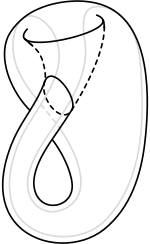
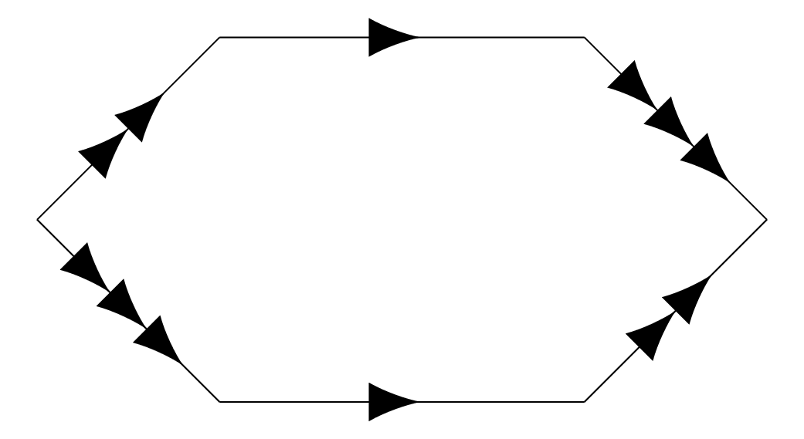
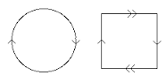
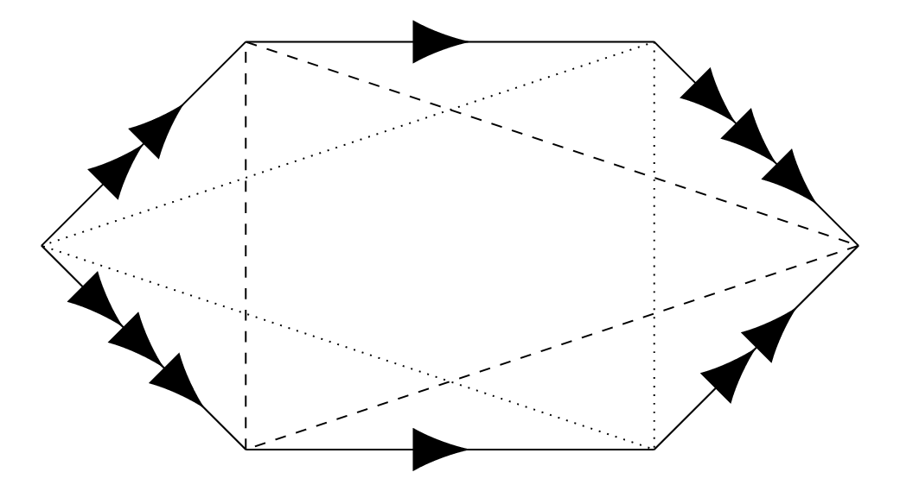

We begin by stating the classification of surfaces.

Classification of Surfaces
----

Every closed, compact surface $$S$$ is either
1. A surface of genus $$g$$ with $$g\geq 0$$
2. A sphere with $$k$$ holes cut out and $$k$$ mobius bands glued in their place, for $$k\geq 1$$

First, some notes on the classification

1. Option one contains the orientable surfaces
2. Every surface in option two contains a Mobius band, and hence is unorientable.
3. The sphere is the surface of genus 0
4. Since the sphere with a disk cut out is just a disk, we see taht the sphere with one Mobius band glued in is the same as a Mobius band glued to a disk at its boundary, which was our description of the projective plane $$\mathbb{RP}^2$$.

Klein bottle
====

The Klein bottle is the unorientable surface with $$k=2$$. 

It is most conveniently pictured as a square with the opposite sides identified, but with one pair of sides reversed, as seen in the following picture.

It is not too hard to visualize that this identification pattern gives the picture above.  If we identify the blue edges marked $$B$$ we just get the cylinder.  Now, we have to identify the ends of the cylinder, but with the orientations reversed; to do this we have to pass through the surface itself as seen in the picture.

However, the square does picture does not immediately make it clear that the Klein bottle is the same as the sphere with two holes cut out and two Mobius bands glued in.  If we keep growing the holes until they meet, we see that this is the same as just taking two Mobius bands and gluing them together along their boundary circles.  It possible to see that this is equivalent to the square above by cutting on the correct lines; it is also illustrated in [this youtube video](https://www.youtube.com/watch?v=a5Azcwe9p4o)

Question
====

Suppose we are given a surface by having a polygon with $$2k$$ sides identified in pairs.  How can you tell which surface in the classification do you have?

As an example, consider the hexagon with opposite sides identified:

What surface is this?  To be able to answer this question, we introduce the Euler characteristic.

Euler characteristic
----

Definition
====

Suppose that we have a surface $$S$$ with a graph $$\Gamma$$ on it, so that each component of the complement of $$\Gamma$$ is a disk.  These components are called "faces".  

Suppose that $$\Gamma$$ has $$v$$ vertices, $$e$$ edges, and $$f$$ faces, the *Euler characteristic* of $$S$$ is $$\chi(S)=v-e+f$$.

Note that we write $$\chi(S)$$, and call it the euler characteristic of $$S$$, but to calculate it we seem to use the graph $$\Gamma$$ drawn on the surface.  We have

Theorem: The Euler characteristic is well defined
===

We will prove this theorem in the next lecture (we began the proof at the end of this lecture).  The main idea is the following -- we need to show that if we have tow graphs $$\Gamma_1$$ and $$\Gamma_2$$ drawn on the same surface $$S$$, and we compute the euler characteristic using $$\Gamma_1$$ and $$\Gamma_2$$, then we get the same number.   The general outline of the proof is that there are few basic changes we can make to graphs on surfaces, and that these moves don't change the Euler characteristic and that we can get between $$\Gamma_1$$ and $$\Gamma_2$$ using a series of these moves.

Example: The sphere $$S^2$$
====

There sphere has Euler characteristic 2.  We can check this using platonic solids -- for instance, the cube and the tetrahedron.  The cube graph has 8 vertices (the corners), 12 edges, and 6 faces.  Using the cube to calculate the euler characteristic we have

$$\chi(S^2)=v-e+f=8-12+6=2$$

We could also compute the euler characteristic of the sphere using the tetrahedron.  The tetrahedron has 4 vertices, 6 edges and 4 vertices, and so we have

$$\chi(S^2)=v-e+f=4-6+4=2$$

Example: The torus 
====

The torus has Euler characteristic 0; we can see that by taking the standard presentation of the torus as a square with opposite sides identified.

This clear has one face, the square, so $$f=1$$.  The square has 4 sides, but they get identified in pairs, so there are really only two edges on the resulting graph, and $$e=2$$.

Similarly, the square has four vertices, but when we identify the sides these all get identified into one, and so really $$v=1$$.

And indeed, $$\chi(T)=v-e+f=1-2+1=0$$.

Example: Projective space $$\mathbb{RP}^2$$
====
Projective space is the circle with opposite sides identified; deforming this slightly, we could also see that it is a square with opposite sides identified, but with both sides changing the orientation -- this is equivalence is in the following picture:

In the circle picture, there is one face, one vertex, and one edge, for $$\chi(\mathbb{RP}^2)=1-1+1=1$$.  In the square picture there are two vertices, two edge, and one face, for $$\chi(\mathbb{RP}^2)=2-2+1=1$$.

Identifying a surface in the classification
-----

The previous examples illustrate that Euler characteristic solves a problem we had with the classification -- telling which surface we had.

Proposition
====
1. The oriented surface $$S_g$$ of genus $$g$$ has euler characteristic $$\chi(S_g)=2-2g$$
2. The unorientable surface $$U_k$$ made by gluing $$k$$ Mobius bands into the sphere has euler characteristic $$\chi(U_k)=2-2k$$.

We see from the proposition that the euler characteristic itself does not determine the surface -- for instance, both the torus and Klein bottle and torus have euler characteristic 0.  But knowing the euler characteristic and whether the surface is orientable or not determines which surface we have.

If we are given a surface as a polygon with its edges identified, we can use this fact to figure out what surface we have.  We need to determine whether the surface is unoriented or not, and what its euler characteristic is.

The surface is oriented if each pair of edges is identified with arrows pointing in the same direction; if the direction of even one pair of edges needs to be switched, the surface is unorientable.

We can compute the euler characteristic as in the example above -- it is easy to count the faces, and the edges are identified in pairs; with a little more work you can track which vertices get identified to calculate the total number of vertices.

Example
====

We return to the hexagon with opposite sides identified:

The surface is orientable since we are gluing the edges together in the same direction.  

To calculate the euler characteristic, it is clear that there is one face, and 3 edges.  All that remains is to see how the vertices are identified.  The dotted and dashed lines we have added to the drawing track this.  The vertical lines come from the fact that the top and bottom edges are identified, therefore the head and tail of that edge are identified.  The other two pairs of sides give the other lines on the graph.

Thus, the surface has a graph with 2 vertices, 3 edges, and one face, and so has

$$\chi(S)=v-e+f=2-3+1=0$$

Since it is orientable as well, we see that the surface is the torus. 

