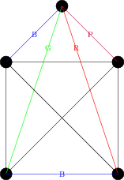
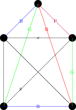
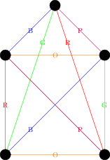
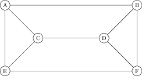

This lecture we will finish up the Chromatic number, cover the chromatic index, and begin studying the chromatic polynomial.

6 Colour Theorem, finished
---

We ended lecture in the middle of the proof of the six colour theorem:

Theorem
====
Any planar graph has $$\chi(G)\leq 6$$.

Last time, we saw that if every planar graph had a vertex $$v$$ of degree at most 5, then we could prove the 6 colour theorem by inductively deleting vertices $$v$$ of degree at most 5.  All that remains is to prove:

Lemma
====

Any planar graph $$G$$ has a vertex $$v$$ of degree at most $$5$$.  

Proof
====
The proof uses Euler's theorem and handshaking.  Suppose that $$G$$ has $$v$$ vertices and $$e$$ edges, and we have drawn $$G$$ on the plane with $$f$$ faces.  Then by Euler's theorem $$v-e+f=2$$.  

Now, suppose that every vertex had degree at least 6.  Then by the handshaking lemma, we see that $$6v\leq 2e$$, or $$v\leq e/3$$  On the other hand, if we want to colour $$G$$ it can't have any loops, and multiple edges don't effect vertex colourings, and so we may assume $$G$$ simple.  This means that every face has at least 3 vertices, and so $$3f\leq 2e$$, or $$f\leq 2/3 e$$.  

Thus, we have

$$\chi(G)=v-e+f\leq e/3-e+2/3 e=0$$

a contradiction, and so we our initial assumption that every vertex of $$G$$ has degree at least 6 must have been wrong.  $$\square

Edge Colourings
----

Similarly to trying to colour the vertices of $$G$$, we could try to colour the edges, with the desire that edges that share a vertex have different colours.

Definition
====

The *chromatic index* of $$G$$, denoted $$\chi^\prime(G)$$, is the least number of colours necessary to colour the edges of $$G$$ so that any two edges that share a vertex have different colours.

To determine the chromatic index of a graph one first obtains an upper bound by actually colouring the edges.  Then one shows a lower bound by proving that less colours can't be used.  This can be done by analyzing what happens if we try to use less colours, or sometimes by a count of the number of edges and how many can be in a given group.

Example: $$K_4$$ 
===

Let's find $$\chi^\prime(K_4)$$.  Picking any vertex $$v$$, there are three edges incident to $$v$$, and none of these edges can have the same colour (as they all meet at $$v$$).  Hence, we have $$\chi^\prime(K_4)\geq 3$$.

On the other hand, it is easy to colour the edges of $$K_4$$ with three colours, as seen below, and so $$\chi^\prime(K_4)\leq 3$$, and hence $$\chi^\prime(K_4)=3$$.

Example: $$K_5$$.
===

Now, let's move on to $$K_5$$.  Again, looking at any vertex we see all the edges adjacent to that vertex must be different colours, and so we have $$\chi^\prime(K_5)\geq 4$$.   Let's try to colour the edges of $$K_5$$ with 4 colours.

Suppose we coloured the four edges adjacent to the top vertex blue, green, red and purple, from left to right, and now look at the bottom edge.  It is adjacent to edges coloured green and red, and so must be blue or purple.  By symmetry, it's equivalent to colour it either colour, so let's suppose it's blue, giving us the following picture:

Now the edge on the right is adjacent to edges coloured red, blue and purple, and so must be green.  But now we have a problem -- consider the edges labeled $$x$$ and $$y$$ in the next drawing:

Both edges share vertices with edges coloured green, blue, and purple, and hence each would need to be coloured red.  But they also share a vertex with each other, and so cannot both be coloured red.  So we see $$\chi^\prime(K_5)\geq 5$$.  

On the other hand, it is easy to colour the edges of $$K_5$$ with 5 colours:  colour each edge in the outside pentagon a different colour.  For each edge in the outside pentagon there will be a unique edge in the inside star that does meet that edge (the one "parallel" to it) -- draw that edge the same colour.  That results in the following colouring:

We saw the last lecture that the chromatic number of a graph had an upper bound of $$\Delta(G)+1$$; it turns out that this holds for the chromatic index as well, although the proof is more difficult and we will skip it:

Vizing's Theorem
====

Let $$G$$ be a simple graph with largest vertex degree $$\Delta(G)$$.  Then 

$$\Delta(G)\leq \chi^\prime(G)\leq \Delta(G)+1$$

Proof
===

The lower bound is trivial -- let $$v$$ be the vertex with degree $$\Delta$$.  The $$\Delta$$ edges adjacent to $$v$$ all need different colours.  Upper bound is harder.

Application: Chromatic number and chromatic index
====

We now give application of chromatic number and chromatic index of the same graph. 

Suppose there are six friends, Alice, Bob, Charlie, Dora, Elizabeth and Frank, and there is the following graph between then:

<table>
<tr> <td>A</td> <td></td><td></td><td></td><td></td><td></td></tr>
<tr> <td>x</td><td>B</td><td></td><td></td><td></td><td></td></tr>
<tr><td>x</td><td></td><td>C</td><td></td><td></td><td></td></tr>
<tr><td></td><td>x</td><td>x</td><td>D</td><td></td><td></td></tr>
<tr><td>x</td><td></td><td>x</td><td></td><td>E</td><td></td></tr>
<tr><td></td><td>x</td><td></td><td>x</td><td>x</td><td>F</td></tr>
</table>

which translates into the following graph:

Here are two word problems, one of which relates to the chromatic number, and another relates to the chromatic index of $$G$$

1. The friends want to divide into groups, but the xs indicate people who currently annoy each other.  What's the least number of groups the friends can divide into groups so that no group contains two people who annoy each other.
2. The friends want to hold a snooker tournament, with everyone playing three matches; the xs indicate pairs of friends who will play against each other.  If multiple matches can be played each day, but each person can only be involved in one match a day, how many days are necessary to hold the tournament?

The first case concerns the chromatic number -- each group of people will be the people who have the same colour, and we don't want vertices with an edge between them to have the same colour.  

The second case concerns the chromatic index -- the edges are the games that are being played, and all edges that are the same colour will be played on the same day.

To end today, let us quickly compute the chromatic number and chromatic index of the graph $$G$$ above.  To compute the chromatic number, we observe that the graph contains a triangle, and so the chromatic number is at least 3.  But it is easy to colour the vertices with three colours -- for instance, colour A and D red, colour C and F blue, and colur E and B green.  So $$\chi(G)=3$$.

To compute $$\chi^\prime(G)$$, since A has degree three we have $$\chi^\prime(G)\geq 3$$.  On the other hand, it is easy to colour the edges with three colours -- for instance, colour AB, CE and DF red, colour AE, CD and BF blue, and colour AC, BD and EF green.  So $$\chi^\prime(G)=3$$ as well.

Chromatic polynomial
----

Instead of just asking whether the vertices of a graph can be coloured using $$k$$ colours, one could try to *count* how many different ways the graph can be coloured using that many colours.

Definition
====

Let $$G$$ be a simple graph and let $$k$$ be a positive integer.  The *chromatic polynomial*, written $$P_G(k)$$ counts the number of ways to colour the vertices of $$G$$ with $$k$$ colours

Example: The complete graph
====

Suppose we want to colour the complete graph $$K_n$$ with $$k$$ colours.  We colour the vertices one by one.  For the first vertex, we can choose any of the $$k$$ colours.  For the second vertex, we can choose any colour except the one used in the first vertex, and so we have $$k-1$$ choices.  For the third vertex, we must pick a new colour, and hence have $$k-2$$ choices.  Continuing in this manner, we see for the last vertex we will have $$k-(n-1)$$ choices.  Thus, we see that

$$P_{K_n}(k)=k\cdot (k-1)\cdot (k-2)\cdots (k-(n-1))$$

Note that if we put in a number from $$\{0,\dots,n-1\}$$ we get 0, which makes sense because we cannot colour $$K_n$$ unless we have at least $$n$$ colours.  This leads to

Lemma
===

The chromatic number $$\chi(G)$$ is the least number $$k$$ so that $$P_G(k)\neq 0$$.

