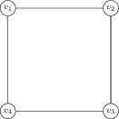
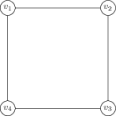

At the end of the last lecture, we introduced the chromatic polynomial $$\chi_G(k)$$, which counts the number of ways to colour $$G$$ with $$k$$ colours.  We demonstrated that the chromatic polynomial of the empty graph $$E_n$$ was $$k^n$$, and the chromatic polynomial of the complete graph $$K_n$$ was $$\chi_{K_n}(k)=k\cdot(k-1)\cdot (k-2)\cdots (k-n+1)$$.  

Recall the chromatic number $$\chi(G)$$ is the least number $$k$$ so that $$G$$ can be coloured with $$k$$ colours.  If $$G$$ can't be coloured with $$k$$ colours, then there are 0 colourings of $$G$$ with $$k$$ colourings, and so $$P_G(k)=0$$.  If $$G$$ *can* be coloured with $$k$$ colourings, then there is at least one such colouring, and so $$P_G(k)>0$$.  Thus, we see that the chromatic polynomial $$P_G(k)$$ determines the chromatic number $$\chi(G)$$.

Lemma
=====
The chromatic number $$\chi(G)$$ is the least number $$k$$ so that $$P_G(k)\neq 0$$.

For certain graphs, one can calculate the chromatic polynomial just by starting at a vertex, and attempting to colour nearby vertices.  We illustrate this now for a couple of graphs, and also show how for more complicated graphs this method becomes more complicated.

Example: The path graph $$P_n$$
====

Recall the path graph $$P_n$$ consisted of $$n$$ vertices, with vertex $$v_i$$ adjacent to vertices $$v_{i\pm 1}$$.

Starting at the end vertex $$v_1$$, there are $$k$$ possible colours we can colour it.  Moving onto vertex $$v_2$$, it can't be the same colour as $$v_1$$, but otherwise could be any colour, and so there are $$k-1$$ possible colours.  

Similarly, $$v_3$$ can be any colour except that of $$v_2$$, and similarly for each vertex, and so we see $$P_{P_n}=k(k-1)^{n-1}$$.$$\quad\square$$

Note that the above argument holds for any tree, and so all trees have the same chromatic polynomial.

Example 
===

Consider the graph $$G$$ above.  Vertex $$1$$ has $$k$$ possibilities, then vertex 2 is adjacent to vertex 1, and so has $$k-1$$ possibilities.  Vertex 3 is adjacent to 1 and 2, which are known to be different colours, and so has $$k-2$$ possibilties.  Similarly, vertex 4 is adjacent to 2 and 3, which are adjacent and hence have different colours, and so vertex 4 has $$k-2$$ possibilities as well, and so $$P_G(k)=k(k-1)(k-2)^2$$

Example: $$C_4$$
====

Now consider the graph $$C_4$$, as shown above.  Vertex $$1$$ can be any of $$k$$ colours, and vertex 2 has $$k-1$$ possibilities -- any colour except the one used for vertex $$1$$.  Moving to vertex 4, we see it is just adjacent to $$1$$ as well, and so has $$k-1$$ possibilities as well.

It becomes more difficult when we try to colour vertex 3.  It is adjacent to vertices 2 and 4, and so cannot be the same colour as either of these.  However, vertices 2 and 4 are not adjacent, and so we don't know whether they have the same colour or not.  If vertices 2 and 4, have the same colour there are $$k-1$$ possibilities for vertex 3, while if vertices 2 and 4 have different colours, there are only $$k-2$$ possibilties.  Thus, we must count how many possibilities are in each of these cases.

If we want vertices 2 and 4 to have the same colour, we can first colour vertex 1 in $$k$$ different ways, and then pick any of the remaining $$k-1$$ colours for vertices $$2$$ and $$4$$.  Then, to complete this to a colouring of $$C_4$$, with have to colour $$v_3$$, which can be any of the $$k-1$$ colours that aren't the colour $$v_2$$ and $$v_4$$ are coloured.  Thus, the case where $$v_2$$ and $$v_4$$ have the same colour has $$k(k-1)^2$$ possibilities.

If we want vertices 2 and 4 to have different colours, then we can first colour $$v_1$$ any of $$k$$ colours, colour $$v_2$$ any of $$k-1$$ colours.  Now, when we go to colour vertex 4 it can't be the same colour as vertex 1 since they are adjacent, and it can't be the same colour as vertex 2 by our supposition.  Vertices $$v_1$$ and $$v_2$$ have different colours, and so this leaves $$k-2$$ possibilities for $$v_4$$.  Thus there are $$k(k-1)(k-2)$$ possibilities to colour vertices 1, 2 and 4 so that 2 and 4 have different colours, and then there are $$k-2$$ possibilities left for vertex 3, giving $$k(k-1)(k-2)^2$$ ways to colour $$C_4$$ so that vertices 2 and 4 have different colours.  

Adding the two cases together, this gives 

$$P_{C_4}(k)=k(k-1)^2+k(k-1)(k-2)^2=k(k-1)[k-1+(k-2)^2]=k(k-1)(k^2-3k+3)\quad\square$$

For larger graphs, sometimes the colouring method we used above will work well, while for others the type of case by case analysis we needed for $$C_4$$ will explode and make it intractible.  To prove that $$P_G(k)$$ is a polynomial, we will need a general method to deal with it.  

Deletion Contraction
----

Consider an edge $$e$$ in a graph $$\Gamma$$.  There are two new graphs we can make -- we can delete the edge $$e$$, getting a graph $$\Gamma\setminus e$$, that has the same vertex set and one less edge.

We can also *contract* $$e$$ -- that is, shrink it to a point.  Doing this may create multiple edges -- for instance, if we contract an edge in the triangle $$C_3$$, we get two vertices connected by two edges, which we will call $$C_2$$.  These extra edges will not matter for the chromatic polynomial, so if we have multiple edges we will delete the extra copies.  This simplification is necessary, because if we contracted one of the edges of $$C_2$$, we would get a loop, which can't be coloured at all!  

The resulting graph $$\Gamma/e$$ has one less vertex (the two vertices adjacent to $$e$$ have been identified to one) and at least one less edge (the one contracted), but possibly more (if we had to delete some multiple edges).

We want to prove:

Lemma
===

$$P_{\Gamma\setminus e}(k)=P_{\Gamma}(k)+P_{\Gamma/e}$$

Proof
====

Suppose the edge $$e$$ connects vertices $$v$$ and $$w$$.

Consider a colouring of the graph $$\Gamma\setminus e$$.  Then, either the vertices $$v$$ and $$w$$ have the same colour or they have different colours.  If they have different colours, then this colouring is a valid colouring of $$\Gamma$$ itself.

It may happen, however, that $$v$$ and $$w$$ have the same colour.  Such a colouring does not give a colouring of $$\Gamma$$.  However, it does give a colouring of $$\Gamma / e$$, and furthermore any colouring of $$\Gamma / e$$ gives a colouring of $$\Gamma\setminus e$$ where $$v$$ and $$w$$ are the same colour.  $$\square$$

If we rewrite the statement of the lemma as 
$$P_\Gamma(k)=P_{\Gamma\setminus e} (k)-P{\Gamma/e}(k)$$
then we get a recursive way to calculate chromatic functions, as the graphs $$\Gamma\setminus e$$ and $$\Gamma/e$$ each have less edges than $$\Gamma$$. 

We will use this recursive equation to prove that the chromatic polynomial is in fact a polynomial.  As is usual in proofs using a recursion, the proof will use induction.  It is fun for a last proof for the course because it is a double induction, on the number of vertices AND the numebr of edges.

Lemma
===
Let $$\Gamma$$ be a graph with $$n$$ vertices and $$m$$ edges.  The function $$P_\Gamma(k)$$ is a polynomial of degree $$n$$, with leading coefficent $$x^n$$ and second order term $$-mx^{m-1}$$, that is:

$$P_\Gamma(x)=x^n-mx^{n-1}+\dots$$ 

where the dots are lower oder terms.

Proof
===

We use induction on $$m$$ and $$n$$.  As a base case, the empty graph $$E_n$$ has $$P_{E_n}=k^n$$, which holds.

Now suppose that $$\Gamma$$ is a graph with $$n$$ vertices and $$m$$ edges, and we have proven the lemma for all graphs with less than $$n$$ vertices, and for all graphs with $$n$$ vertices but $$j<m$$ edges.  Picking any edge $$e$$ of $$\Gamma$$ and applying deletion-contraction, we have:

$$P_{\Gamma}(x)=P_{\Gamma\setminus e}(x)-P_{\Gamma/e}(x)$$.

By the inductive hypothesis, both the terms on the right hand side are polynomials, so $$P_{\Gamma}(k)$$ is a polynomial.  We have $$P_{\Gamma\setminus e}(k)=x^n-(m-1)x^{n-1}+\cdots$$ and $$P_{\Gamma/e}(k)=x^{n-1}+\cdots$$, so the statements about the degree, leading coefficient, and second coefficient all follow.

