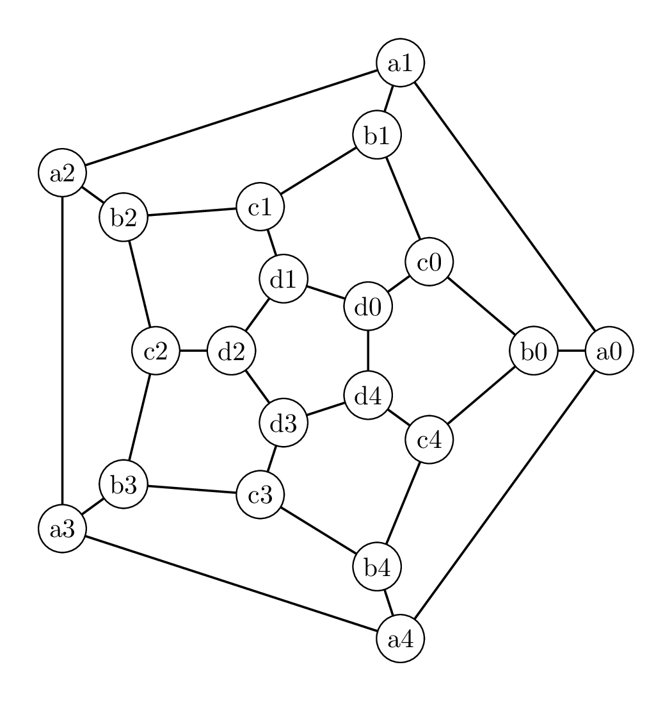
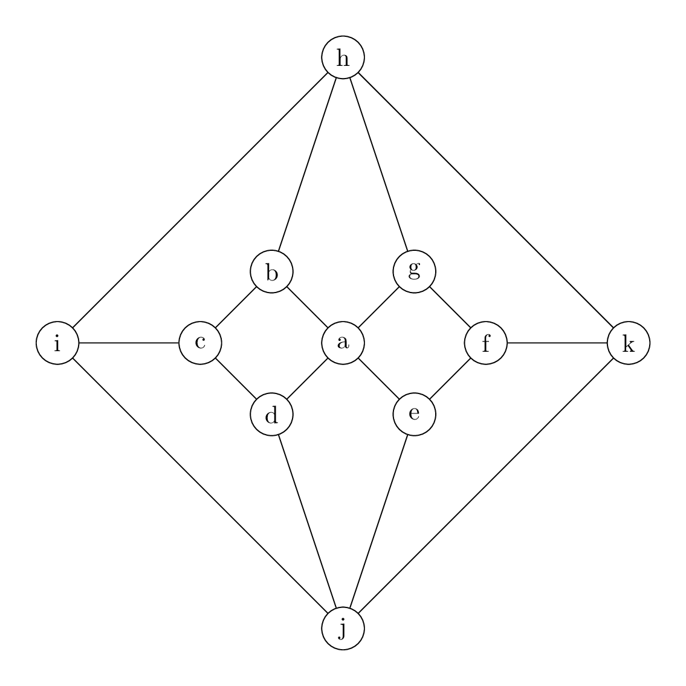

The icosian game
====

Hamilton marketed an ``icosian game'', whose object was to find Hamiltonian cycles on various graphs.  The base graph was the vertices an edges of a dodecahedron (as pictured below).  Find a Hamiltonian cycle for that graph. 

More challenging; prove that if we delete one vertex from this graph (say, a1) and the three edges adjacent to the vertex, the resulting graph with 19 vertices does *not* have a Hamiltonian cycle (some case by case analysis is needed).

More on finding Hamiltonian cycles or proving they don't exist
=====

Determine the number of Hamiltonian cycles in each of the following graphs.  Two cycles count as the same if they use the same edges -- starting at a different vertex or going backwards doesn't make it different.  Also, the answer may be zero.

Hamiltonian cycles in Platonic solids
=====

Show that that all the platonic solid graphs are Hamiltonian.  How many Hamiltonian cycles in the tetrahedron?  In the cube?  Octahedron?  