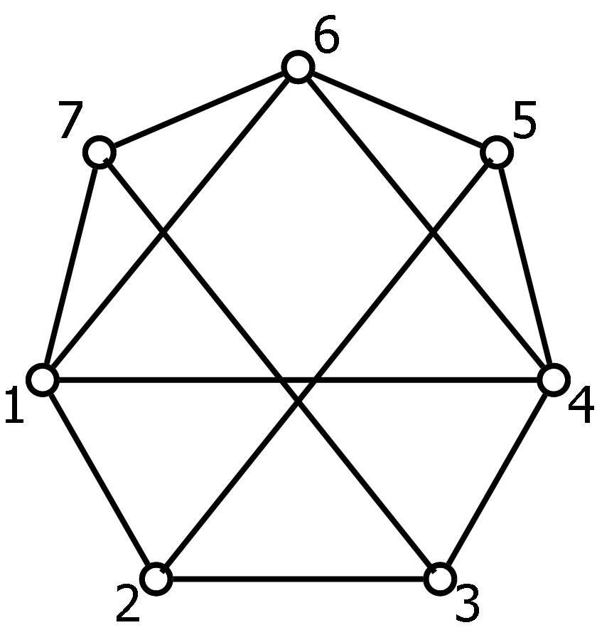
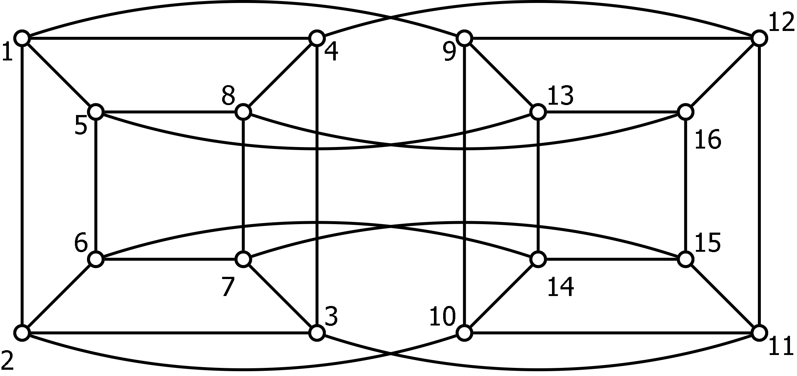

The most basic thing you have to do is either proof a graph is planar or not, and be able to draw graphs on other surfaces (the torus this week, and starting next week on the projective plane $$\mathbb{RP}^2$$ and the Klein Bottle).

Example 1
=====

Consider the graph $$G$$ below.  Prove that $$G$$ is not planar by analysing whether edges go inside or outside a Hamiltonian cycle.  Give another proof that it is not planar by using Kuratowski's theorem.  Finally, draw $$G$$ on the Torus and the real projective plane.

Example 2
=====

A graph $$H$$ representing the edges of a 4-dimensional cube is shown below.  Find a subgraph which is a subdivision of $$K_{3,3}$$, and another subgraph that is a subdivision of $$K_5$$, and thus determine that $$H$$ is nonplanar.  Draw $$H$$ on the torus (being sure to label the vertices).

