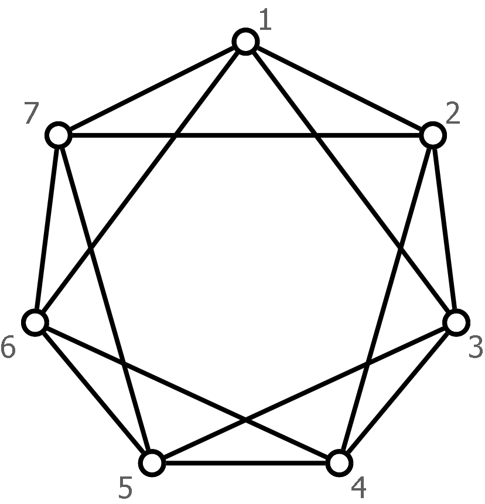
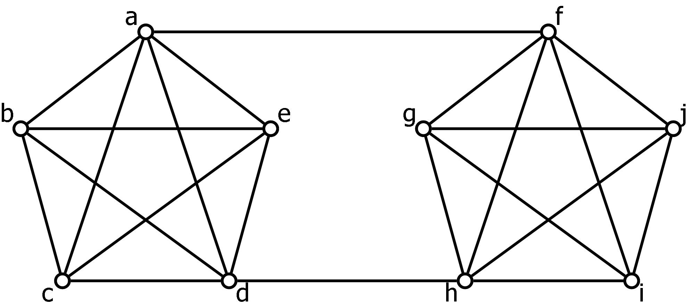

Chromatic number and index
----

Find the chromatic number $$\chi(G)$$ and the chromatic index $$\chi^\prime(G)$$ for the following graphs:

A word problem
----

Eleven football games are to be arranged among eight temas A to H as follows:

- A plays F, G, H
- B plays E, F, H
- D plays C, E, G
- E plays G
- F plays H

If no team can play more than onces a week, what is the minimum number of weeks needed to schedule all the games?  Justify your answer.