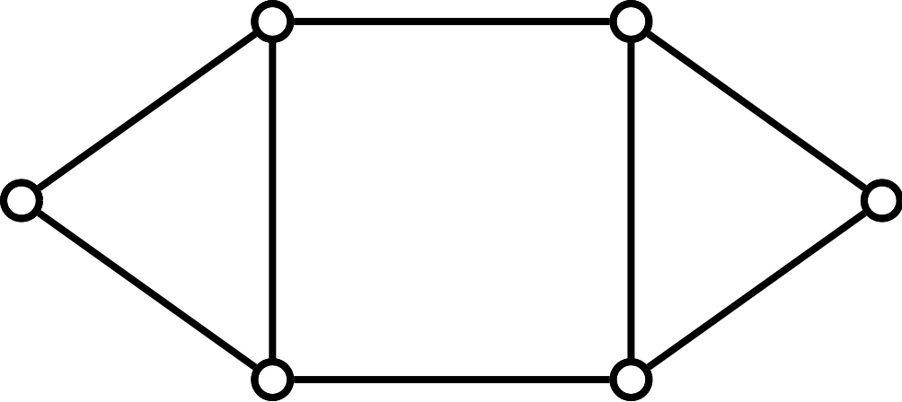
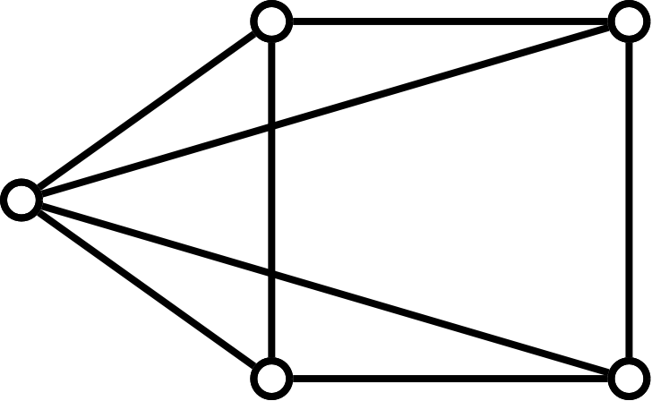
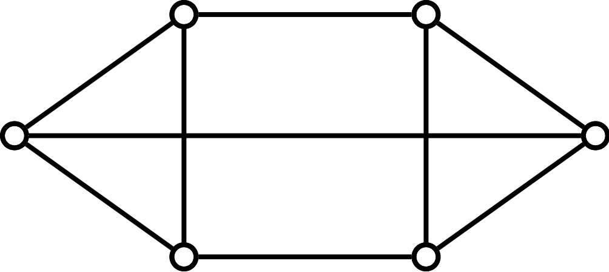

We have a few exercises about chromatic polynomials.

Chromatic number of cycles
----

Let $$C_n$$ be the $$n$$-cycle.  We saw in lecture that $$\chi_{C_3}(k)=k(k-1)(k-2)$$, and that $$\chi_{C_4}(k)=k(k-1)(k^2-3k+3)$$.

Find $$\chi_{C_5}(k)$$.

In general, it can be shown using induction that $$\chi_{C_n}(k)==(k-1)^n+(-1)^n(k-1)$$ -- see the 2014 Exam for one way of doing this, though there are others.

A series of examples:
----
Find the chromatic polynomial of the following graphs.  YOu should use the chromatic polynomial of $$C_4$$ as a given.

a. 
b. 
c. 

