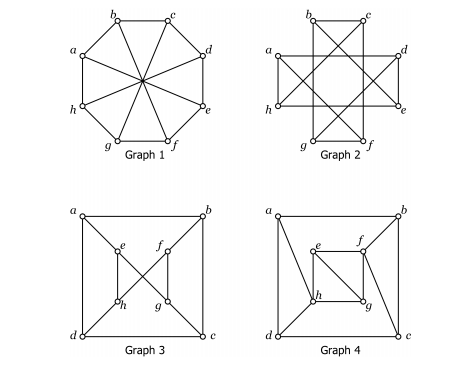

Question 1 (8 Marks, 2015 Exam)
-----

Define an isomorphism of graphs.  Which of the following graphs are isomorphic?  Justify your answer.  

Question 2 (10 Marks)
-----
a) Define what it means for a graph to be Eulerian, semi-Eulerian, Hamiltonian, and semi-Hamiltonian.

b) Give an example of a graph with 5 vertices such that $$G$$ is Hamiltonian but not semi-Eulerian.  Justify that $$G$$ has these properties.

c) Give an example of a graph with 5 vertices such that $$G$$ is Eulerian but not semi-Hamiltonian.  Justify that $$H$$ has these properties.

Question 3 (7 Marks)
-----

Given that Fluorine ($$F$$) has valency 1, prove that any molecule with formula $$C_5H_{11}F$$ is a tree.  How many isomers does $$C_5H_{11}F$$ have?  Draw them.

