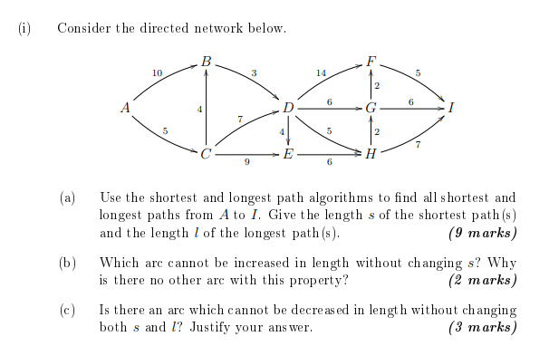
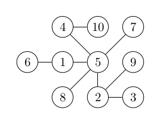

Question 1 (8 Marks, 2016 Exam)
-----

The distances between seven towns are given in the table below.

$$\begin{array}{ccccccc}
A  &   &   &   &   &   &  \\
70 & B &   &   &   &   &  \\
62 & 57& C &   &   &   &  \\
66 & 47& 58& D &   &   &  \\
78 & 66& 59&95 & E &   &  \\
80 &83 & 61&99 &79 & F &  \\
75 &64 &71 &65 &40 &42 &G
\end{array}$$

Use the nearest neighbour algirthm, starting at $$A$$, to find an upper bound on the travelling salesman problem for these towns.  By omitting $$A$$, give a good lower bound for the travelling salesman problem.

Question 2 (2014 Exam)
------
I didn't set this question; 9 marks for (a) seems perhaps slightly high to me

Question 3 (4 marks)
------

Find the Prufer code for the following tree:

