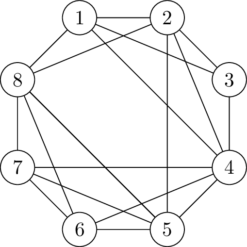

Hand in any time before Easter break to have it marked for feedback; these questions do not count toward your final mark for the module.

This problem is, with minor adaptions, a question from the 2006 exam.

Part A (9 marks)
-----
State Euler's Theorem for plane graphs, and use it to show that if a $$G$$ is a plane graph with no vertices of degree less than 3 or cycles with length less than 4, then $$G$$ must have at least 8 vertices and at least 12 edges.  Give an example to show that these bounds cannot be improved.

Part B (2 Marks)
----
Suppose that $$G$$ is any graph with no vertices of degree less than 3 or cycles with length less than 4 -- must $$G$$ be planar?  Justify your answer.

The rest of this question use the graph $$\Gamma$$ show below.

Part C (5 Marks)
---
Use the Planarity Algorithm for Hamiltonian Graphs (with the Hamiltonian cycle 123456781) to show that $$\Gamma$$ is not planar.

Part D (5 Marks)
---
State Kuratowski's Theorem, and use it to give another proof that $$\Gamma$$ isn't planar.

Part E (4 Marks)
----
Draw $$\Gamma$$ on the torus so that no edges cross.

