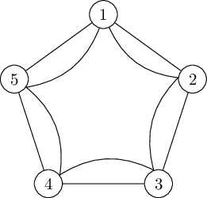
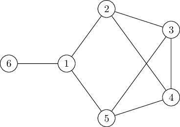

Hand in by the end of Week 11 -- i.e. Friday May 10th --  to have it marked for feedback; these questions do not count toward your final mark for the module.

Question 1 (7 marks, 2014 Exam)
===
Each of seven students has chosen three courses from ten options, and must sit an exam for each of his or her three choices.  Two students sitting the same exam must do so at the same time, but no student can sit more than one exam in the same day.  The table of choices is given below:

$$\begin{array}{cc|cc}
\text{student} & \text{Exams} & \text{student} & \text{Exams}  \\
A & 1,2,3 & E & 6,8,10 \\ 
B & 1,4,5 & F & 7,8,9 \\
C & 2,4,6 & G & 1,9,10 \\
D & 3,5,7 & &
\end{array}$$

Explain how to relate this question to a graph $$G$$ so that the chromatic number of $$G$$ is the smallest number of days required to schedule the exams.  Find this number; you should give an example of a schedule with that number of days and explain why it cannot be done with fewer.

Question 2 (4 marks, 2014 Exam)
===

Define the *chromatic index* of a graph.  What is the chromatic index of the graph shown: 

Question 3 (14 marks, adapted from 2011 exam)
===

Part 1 (4 marks)
---

Define the chromatic polynomial $$P_\Gamma(k)$$ of a graph $$\Gamma$$.  Explain how to determine the number of vertices, the number of edges, and the chromatic number of $$\Gamma$$ from $$P_\Gamma(k)$$.

Part 2 (5 marks)
---

State the deletion-contraction relation for $$P_G(k)$$, and use it to prove that $$P_G(k)$$ is indeed a polynomial.

Part 3 (5 points)
---
Determine the chromatic polynomial $$P_H(k)$$ of the graph $$H$$ shown below:

